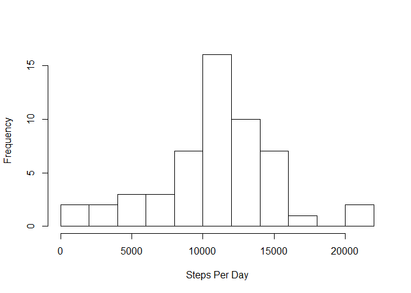
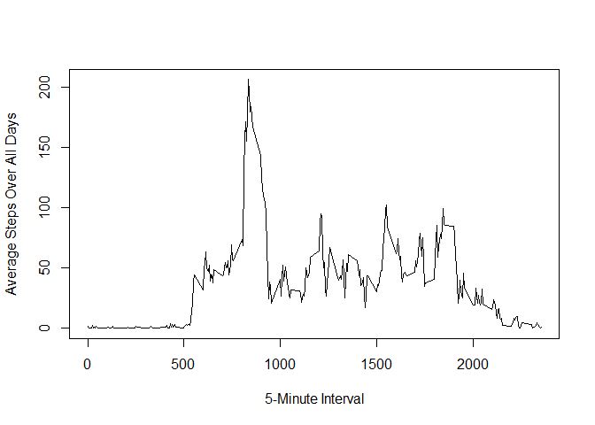
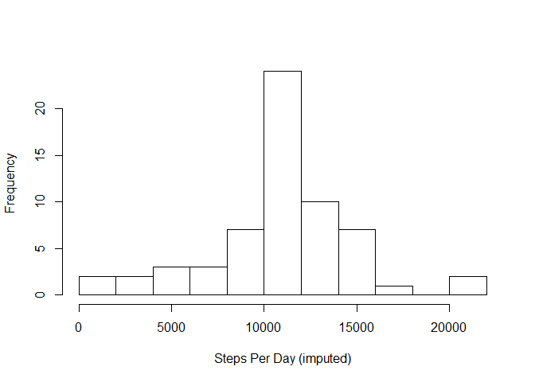
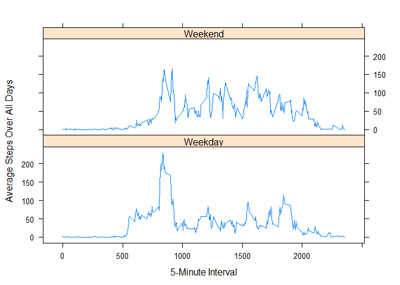

## Reproducible Research Course Project 1  
Ryan Jacobs
------------------------------------------------------------------
------------------------------------------------------------------
### Loading libraries

First, we need to load all of the necessary libraries: dplyr, chron, and lattice.

```r
library(dplyr); library(chron); library(lattice)
```

```
## 
## Attaching package: 'dplyr'
```

```
## The following objects are masked from 'package:stats':
## 
##     filter, lag
```

```
## The following objects are masked from 'package:base':
## 
##     intersect, setdiff, setequal, union
```

### Loading and preprocessing the data

Here, we load the raw dataset and convert the date variable into the Date class.

```r
data <- read.csv("activity.csv")
data$date <- as.Date(data$date)
```

### What is mean total number of steps taken per day?

First, we group the data by day.

```r
grouped_by_date <- group_by(data, date)
```

Then, we compute the number of steps taken each day and store the result in a steps-per-day (spd) data frame.

```r
spd <- summarize(grouped_by_date, steps_per_day = sum(steps, na.rm = FALSE))
```

Now, we can plot a histogram of steps per day with 15 bins.

```r
hist(spd$steps_per_day, 15, xlab = "Steps Per Day", main = "")
```

<!-- -->

Finally, we compute the mean and median number of steps per day, respectively.

```r
mean(spd$steps_per_day, na.rm = TRUE)
```

```
## [1] 10766.19
```

```r
median(spd$steps_per_day, na.rm = TRUE)
```

```
## [1] 10765
```

### What is the average daily activity pattern?

First, we group the data by 5-minute intervals.

```r
grouped_by_interval <- group_by(data, interval)
```

Next, we compute the average number of steps over all days, for each interval, and store the results in a steps-per-interval (spi) data frame.

```r
spi <- summarize(grouped_by_interval, 
                 steps_per_interval = mean(steps, na.rm = TRUE))
```

Then, we can plot steps per interval versus the 5-minute intervals

```r
plot(spi$interval, spi$steps_per_interval, type = "l", 
     xlab = "5-Minute Interval", ylab = "Average Steps Over All Days")
```

<!-- -->

Finally, we can now find the 5-minute interval with the most average steps over all days.

```r
spi$interval[spi$steps_per_interval == max(spi$steps_per_interval)]
```

```
## [1] 835
```

### Imputing missing values

First, we calculate the total number of NA values in the raw dataset.

```r
sum(is.na(data$steps))
```

```
## [1] 2304
```

Next, we impute all NA values in the dataset by replacing them with the average steps taken over all days for each 5-minute interval.

```r
imputed_data <- data
imputed_data$steps[is.na(imputed_data$steps)] <-
        rep(spi$steps_per_interval,sum(is.na(spd$steps_per_day)))
```

Then, we group the imputed data by day.

```r
imputed_grouped_by_date <- group_by(imputed_data, date)
```

Next, we compute the number of steps taken each day and store the result in an imputed spd data frame.

```r
imputed_spd <- summarize(imputed_grouped_by_date, 
                         steps_per_day = sum(steps, na.rm = FALSE))
```

Now, we plot a histogram of imputed steps per day with 15 bins.

```r
hist(imputed_spd$steps_per_day, 15, xlab = "Steps Per Day (imputed)", main = "")
```

<!-- -->

Finally, we compute the mean and median number of steps per day, respectively.

```r
mean(imputed_spd$steps_per_day, na.rm = TRUE)
```

```
## [1] 10766.19
```

```r
median(imputed_spd$steps_per_day, na.rm = TRUE)
```

```
## [1] 10766.19
```
Interestingly, the small differences of the means and medians with and without imputation indicates that the imputation strategy used did not have a large impact on the estimates of total daily number of steps. However, a comparison of the histograms indicates a slightly more peaked distribution of steps per day after imputation.

### Are there differences in activity patterns between weekdays and weekends?

First, we add a factor variable to the imputed dataset that indicates whether the day is a weekend or weekday.

```r
imputed_data <- mutate(imputed_data, day_type = factor(is.weekend(date), labels = c("Weekday", "Weekend")))
```

Next, we group the imputed data by 5-minute interval for weekdays and weekends.

```r
imputed_grouped_by_interval <- group_by(imputed_data, interval, day_type)
```

Then, we compute the average number of steps over all days, for each interval, and store the results in an imputed steps-per-interval (spi) data frame.

```r
imputed_spi <- summarize(imputed_grouped_by_interval, steps_per_interval = mean(steps, na.rm = TRUE))
```

Finally, we plot steps per interval versus the 5-minute intervals for the imputed data and for weekends and weekdays.

```r
p <- xyplot(steps_per_interval ~ interval | day_type, data = imputed_spi, type = "l", xlab = "5-Minute Interval", ylab = "Average Steps Over All Days", layout = c(1,2))
print(p)
```

<!-- -->
